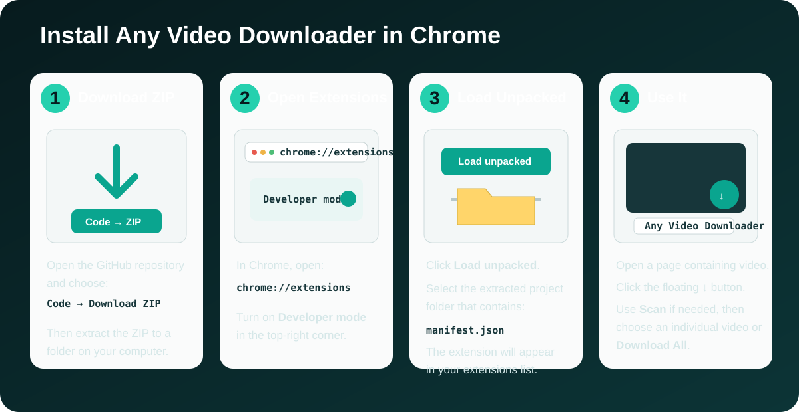
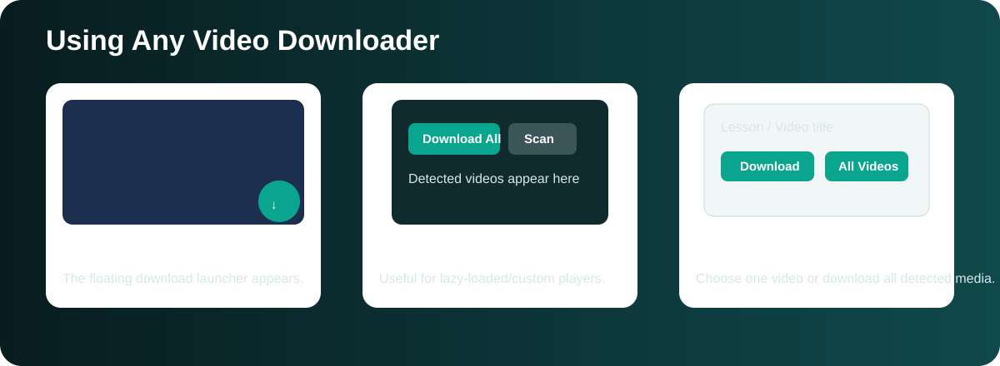

# Any Video Downloader

**Any Video Downloader** is a Chrome Manifest V3 extension for detecting and downloading accessible video/audio media from the current webpage.

## Current version

**v2.10.0 — corrected HLS byte-range assembly and warmup routing**

v2.10.0 fixes the audited causes of Chrome's “could not decode one of the selected media tracks” error on common course-player HLS playlists. It preserves `EXT-X-BYTERANGE` offsets instead of repeatedly concatenating whole backing files, follows the actual frame discovered during the 3.5-second warmup, and avoids an advertised high-bitrate codec when Chrome reports that codec unsupported.

v2.9.6 also discovers video elements inside open shadow roots and generated player frames (`about:blank`, `blob:`, and origin-fallback frames). A real player that is temporarily CSS-hidden or still initializing remains eligible, while visible ready players continue to rank first.

v2.9.5 no longer assumes the media request's reported frame is where the `<video>` lives. On warm-up or fallback, it enumerates the tab's frames, asks each injected helper whether it has a visible video, ranks matches by visible area, and targets the actual player. This covers players whose HLS request is initiated by the top page while their video element is nested in an iframe.

The panel header displays the running version (for example, `Any Video Downloader v2.10.0`). Unpacked extensions do not update automatically: after replacing/pulling files, click **Reload** on `chrome://extensions` and refresh the target page once.

This bounded warm-up is download-initiated only. Scan still never starts playback, unrelated videos are untouched, and the old multi-player autoplay behavior remains removed.

Web services that accept a pasted YouTube URL commonly use a remote extraction/conversion workflow. This extension remains local-only and does not send viewing URLs to an undisclosed third-party conversion server.

## v2.9.0 performance and pre-play changes

- No observer watches global `class` or character-data mutations.
- The capture fallback no longer scans the extension panel on every page mutation.
- Mutation handling is restricted to added/replaced players, media sources, headings, and explicit lesson-selection attributes.
- Scan never calls `video.play()` and does not seek, mute, pause, or otherwise disturb the page player.
- Initial and user-requested scans inspect declarative media URLs that are available before playback.
- YouTube uses accessible `streamingData` URLs and already-signed cipher URLs; it does not execute signature-deciphering code or bypass access controls.

## Main features

- Direct MP4, WebM, MOV and M4V detection.
- Audio stream detection where exposed.
- Unencrypted HLS / M3U8 support.
- Unencrypted MPEG-DASH / MPD support.
- HLS master-playlist and separate-audio rendition handling.
- DASH `SegmentTemplate`, `SegmentTimeline`, `SegmentList`, `SegmentBase`, direct `BaseURL`, and inherited `BaseURL` handling.
- Network detection for custom/iframe players.
- Signed/range-based CDN handling for Googlevideo, Facebook/Instagram CDNs and Vimeo CDNs.
- Full-file recovery when a CDN exposes only a partial `206 Partial Content` request.
- Deduplication of repeated byte-range requests.
- Adaptive video + audio pairing and local merge where supported.
- Uses the current page/lesson/video title for filenames.
- Detects JavaScript/SPA lesson changes without requiring a browser refresh.
- Clears stale media from the previous lesson before scanning the new lesson.
- For HLS course players, uses the page's already-decoded video stream to create a normal MP4 when Chrome supports MP4 recording, otherwise WebM.
- Live download/recording progress.
- No remote executable code or remote conversion server.

## v2.8.0 course / SPA changes

The lesson-context detector now checks several independent signals instead of relying only on the URL:

- checked lesson/radio controls;
- `aria-selected`, `aria-checked`, `data-active`, `data-selected`, and common active lesson states;
- the heading spatially closest to the visible video player;
- course breadcrumbs;
- current sidebar lesson states;
- main lesson headings;
- URL changes, DOM changes, text changes, History API calls, and player/navigation events.

When the detected lesson changes, the extension performs one atomic context switch in the service worker. Repeated events for the same lesson do not clear newly detected media. This is intended for GHL/ClientClub, DigitalMarketer-style course applications, React/Vue/Next SPAs, and similar JavaScript navigation systems.

The main-world navigation hook detects `history.pushState()` and `history.replaceState()` calls that isolated extension scripts cannot reliably monkey-patch. Media candidates and their page context are stored in `chrome.storage.session`, so Chrome may suspend and restart the MV3 worker without silently losing the current scan.

## HLS `.ts` behavior

Older builds could correctly download an HLS lesson but save the assembled MPEG-TS stream as `.ts`. v2.7.0 uses a page-decoded capture path for visible HLS players:

1. Find the active visible `<video>` element.
2. Seek the lesson to the beginning.
3. Capture the stream already decoded by the website's player.
4. Record video and available audio locally with Chrome `MediaRecorder`.
5. Save a real `.mp4` when the installed Chrome build supports MP4 recording, otherwise save `.webm`.
6. Restore the user's previous playback position/state after capture.

This capture path runs approximately at playback speed because it records the decoded media locally. It avoids simply renaming MPEG-TS bytes to `.mp4`, which would create a broken file.

The lower-level HLS processor first assembles fMP4 directly or converts MPEG-TS through Chrome's decoder/MediaRecorder without disturbing page playback. Page-decoded capture is now a fallback only. If Chrome cannot decode or record either path, the operation fails clearly and does not save a misleading `.mp4` or raw `.ts` file.

## Platform coverage

| Platform/type | Expected support |
|---|---|
| Self-hosted HTML5 MP4/WebM | Strong |
| GoHighLevel / ClientClub courses | Strong for accessible direct/HLS media; SPA lesson tracking included |
| DigitalMarketer-style JS courses | Strong for accessible HLS/direct media; no full reload required |
| WordPress / HTML5 / Video.js / JW Player | Strong when accessible direct/HLS/DASH media is exposed |
| Wistia / Brightcove / Bunny / Mux / Cloudflare Stream | Best effort for accessible direct/HLS/DASH delivery |
| Vimeo | Direct/HLS/DASH best effort |
| YouTube | Progressive/adaptive detection, signed-CDN recovery, local video/audio merge when possible |
| Facebook / Reels | Signed direct/adaptive media best effort with byte-range recovery and deduplication |
| Instagram / Reels | Signed direct/adaptive media best effort |
| X/Twitter / Reddit / Dailymotion / Twitch / TikTok / Loom / Streamable | Best effort through direct/HLS/DASH/network detection |
| DRM services such as Netflix / Disney+ / Prime Video / Hulu | Not supported |

Large platforms change player delivery methods and signed URLs frequently. The extension intentionally does **not** bypass DRM, encryption, paywalls, authentication, subscription controls, or access controls.

## Install on Chrome

1. Click **Code → Download ZIP** on this repository.
2. Extract the ZIP to a permanent folder.
3. Open `chrome://extensions`.
4. Enable **Developer mode**.
5. Click **Load unpacked**.
6. Select the extracted folder that contains `manifest.json`.
7. After updating the code, click **Reload** on the extension and refresh the test page once so the new content scripts are loaded.

## How to use

1. Open a webpage containing a video.
2. Open the downloader; playback is not required when the site exposes its media URL before play.
3. Click the floating **↓** button.
4. Click **Scan** if needed. Scanning does not start the player.
5. Download the detected video.
6. On a course SPA, click another lesson normally. The extension should detect the change automatically without a browser reload.

For HLS course videos, the button may display **Download MP4**. During page-decoded capture, keep the lesson tab open until the progress reaches 100%.

## Signed CDN / partial-download recovery

For supported signed CDN media the extension can detect `206 Partial Content`, parse `Content-Range`, and rebuild a complete file with controlled byte-range requests. It retains the original signed URL as a fallback and deduplicates URL-level range observations. On YouTube, decoded page capture is attempted only after an expired/403 Googlevideo fetch, avoiding unnecessary page playback disruption.

## Permissions

- `downloads` — saves user-requested media.
- `offscreen` — locally fetches, assembles and merges user-requested media.
- `storage` — preserves the bounded current-tab candidate cache in session-only storage across MV3 worker suspension.
- `webRequest` — observes media requests generated by webpage players.
- `declarativeNetRequestWithHostAccess` — preserves the expected request context for supported signed media CDNs.
- `<all_urls>` — media is frequently delivered from a CDN/domain different from the page itself.

## Chrome Web Store single purpose

> Detect and download accessible video media from the web page the user is currently viewing for authorized offline use.

## Validation

GitHub Actions checks JavaScript syntax, Manifest V3 wiring, required local processor files, signed-CDN/media-selection smoke tests, and partial-range recovery.

Use the extension only for media you own or have permission to save.
